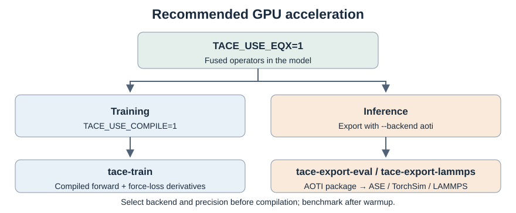

.. _acceleration-tutorial:

Acceleration
============

The standard NVIDIA GPU workflow combines EQX operators with compilation for training
and AOTI export for inference. Set environment variables before constructing,
loading, or exporting the model.

Standard workflow
-----------------

Install EQX build dependencies from the TACE source directory and provide a 
CUDA toolkit:

.. code-block:: bash

   pip install '.[eqx]'

Training
~~~~~~~~

Train with EQX operators and compile the model:

.. code-block:: bash

   TACE_USE_EQX=1 TACE_USE_COMPILE=1 tace-train -cn tace.yaml

Inference
~~~~~~~~~

Export the trained checkpoint with EQX operators and load the compiled package
for evaluation or simulation:

.. code-block:: bash

   TACE_USE_EQX=1 tace-export-eval \
     -m model.ckpt --backend aoti --device cuda

.. code-block:: python

   from tace.interface.ase import TACEAseCalc

   calc = TACEAseCalc(model="model.pt2", device="cuda")

``tace-export-eval`` produces the package for ASE/TorchSim. For LAMMPS, use
``tace-export-lammps`` with the same ``--backend aoti --device cuda`` options;
see :ref:`tace-export-tutorial` for loading instructions.

The AOTI export commands enable the compilation path automatically.
Exporting with ``state_dict`` or ``full_model`` does **not** compile the model.

Alternative backends
--------------------

In either workflow, ``TACE_USE_EQX=1`` can be replaced by the backend flags
below for supported operators. This changes operator implementations, not the
training or export steps. Keep ``TACE_USE_COMPILE=1`` for training and
``--backend aoti`` for compiled inference.

.. list-table::
   :header-rows: 1
   :widths: 20 30 50

   * - Priority
     - Environment variable
     - Scope
   * - 1. EquivariantX
     - ``TACE_USE_EQX=1``
     - Convolution, ACE, element-dependent Linear, and gates
   * - 2. OpenEquivariance
     - ``TACE_USE_OEQ=1``
     - Convolution
   * - 3. EquiTorch
     - ``TACE_USE_EQT=1``
     - ACE
   * - 4. cuEquivariance
     - ``TACE_USE_CUE=1``
     - Convolution

If several flags are enabled, each operator selects the highest-priority
backend it supports: **EQX > OEQ > EQT > CUEQ**. Different operators may therefore
use different backends. Without an enabled, supported backend, an operator
uses its reference PyTorch implementation.

For example, replace EQX with OEQ while keeping the same workflow:

.. code-block:: bash

   TACE_USE_EQX=0 TACE_USE_OEQ=1 TACE_USE_COMPILE=1 tace-train -cn tace.yaml

   TACE_USE_EQX=0 TACE_USE_OEQ=1 tace-export-eval \
     -m model.ckpt --backend aoti --device cuda

Explicitly disabling EQX prevents an inherited ``TACE_USE_EQX=1`` from taking
priority. Backend flags do not replace ``TACE_USE_COMPILE`` or control TF32.
Install the dependencies for each selected backend; a missing dependency
raises an error rather than silently selecting another backend.
See :ref:`installation` for installation commands.

For the standard EQX workflow, the equivalent Python setup is:

.. code-block:: python

   from tace.utils.env import enable_acceleration

   enable_acceleration(enable_eqx=True, enable_compile=True)

This preserves existing settings. ``force=True`` also disables unselected
backends. ASE and TorchSim calculators expose backend options, but an exported
AOTI package already contains its chosen operator graph.

.. _eqx-streaming:

EQX in TACE
-----------

|eqx-convolutions|

.. list-table:: Model-to-operator mapping
   :header-rows: 1
   :widths: 34 66

   * - TACE operation
     - EQX implementation
   * - ``cgtp``
     - ``eqx.conv.O3TensorProductConv``
   * - ``o2_cgtp``
     - ``eqx.conv.O2O3TensorProductConv``
   * - ``uu_o2``
     - ``eqx.conv.UuO2TensorProductConv``
   * - ``o2`` / ``o2_mag``
     - ``eqx.conv.UvO2TensorProductConv``
   * - TECE-OAM-RRA ``so2``
     - ``eqx.models.tace.tece_oam_rra``
   * - Standard / gated bilinear ACE
     - ``eqx.ace.TACE`` / ``eqx.models.tace.tece_oam_rra.BilinearACE``

For fusion boundaries and standalone examples, see
:ref:`equivariantx-convolutions`. To switch between equivalent CGTP forms
without retraining:

.. code-block:: python

   from tace.utils.env import enable_acceleration
   from tace.lightning import convert_cgtp, load_tace

   enable_acceleration(enable_eqx=True)
   model = load_tace("model.pt", device="cuda")
   model = convert_cgtp(model, implementation="o2")  # "o3" for direct CGTP

The default ``implementation="auto"`` switches each CGTP interaction to the
other form. Conversion returns a copy; recreate its optimizer before training.

Precision and warmup
--------------------

.. list-table:: Default TF32 for FP32 operations
   :header-rows: 1
   :widths: 40 30 30

   * - ``TACE_USE_TF32``
     - Training
     - Inference
   * - Unset
     - Enabled
     - Disabled
   * - ``1``
     - Enabled
     - Enabled
   * - ``0``
     - Disabled
     - Disabled

Choose precision before compilation or export; changing the environment does
not recompile an AOTI package.

.. _tace-export-tutorial:

Export and deployment
---------------------

.. list-table::
   :header-rows: 1
   :widths: 30 25 45

   * - Command
     - Backend
     - Purpose
   * - ``tace-export-train``
     - State dictionary
     - Continued training or fine-tuning
   * - ``tace-export-eval``
     - ``state_dict`` / ``full_model``
     - Native PyTorch inference
   * - ``tace-export-eval``
     - ``aoti``
     - Compiled graph for ASE and TorchSim
   * - ``tace-export-lammps``
     - ``mliap`` / ``aoti``
     - Eager or compiled LAMMPS ML-IAP model

Commands accept checkpoints, state-dict packages, and serialized models.
Use ``-o`` for the output path, ``-f`` for fidelity, and ``--dtype`` for
precision. ``tace-compile`` aliases ``tace-export-eval``.

.. important::

   AOTI export requires PyTorch >= 2.13. If using OEQ, use OEQ >= 0.6.4.
   Supported outputs include energy, forces, stress, virials, charges, and
   noncollinear magnetic forces. LES is not supported by this compilation path.

ASE and TorchSim
~~~~~~~~~~~~~~~~

The standard export command above writes ``model.pt2``. TACE creates
synthetic inputs with dynamic node, edge, and graph dimensions; ``--sample``
is an optional override, not a requirement.

``load_tace("model.pt2", device="cuda")`` also loads the compiled graph directly.
The package does not call ``torch.compile`` again, but external operator
registrations and their runtime dependencies remain necessary. EQX-generated
kernels may still require first-use compilation if their cache is absent.
Validate the exported model in the deployment environment.

For non-compiled inference:

.. code-block:: bash

   tace-export-eval -m model.ckpt --backend state_dict --device cpu

This writes ``model.ckpt-state_dict.pt``. The ``full_model`` backend instead
writes ``model.ckpt-full_model.pt`` and is more dependent on Python package
versions.

LAMMPS
~~~~~~

Export a package and an ML-IAP loader:

.. code-block:: bash

   TACE_USE_EQX=1 tace-export-lammps \
     -m model.ckpt --backend aoti --device cuda

This writes:

.. code-block:: text

   model.ckpt-lammps_aoti.pt2   compiled package
   model.ckpt-lammps_aoti.pt    ML-IAP loader containing the package

Point LAMMPS to the loader, not the raw package:

.. code-block:: text

   pair_style mliap unified model.ckpt-lammps_aoti.pt 0
   pair_coeff * * H C N

Use ``--aoti-package`` to choose the package path. ML-IAP requires CUDA Kokkos;
multi-rank runs also require CUDA-aware MPI. See :doc:`lammps` for setup.

Compile for a compatible deployment OS, PyTorch/CUDA ABI, and GPU architecture.
A CUDA package cannot be loaded on CPU. Set backend flags before exporting a
full model or AOTI graph; they do not replace operators in an already compiled
artifact.
