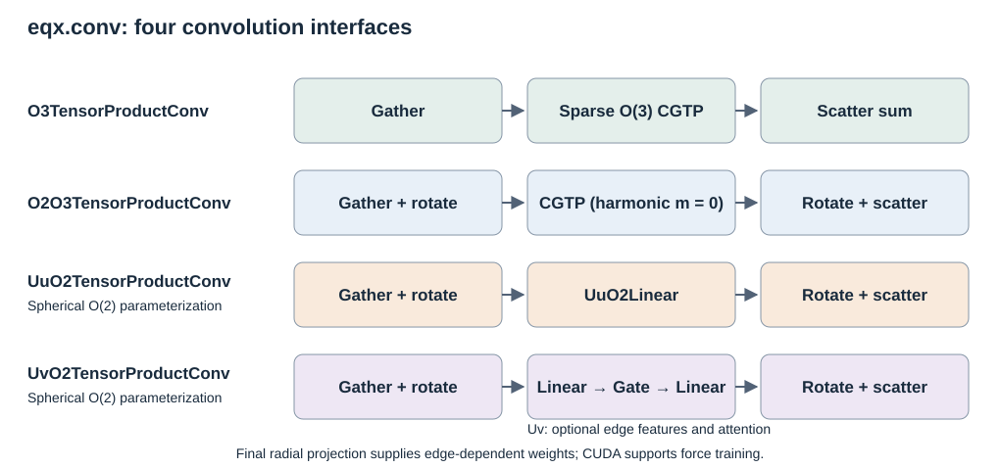

# EquivariantX

EquivariantX (EQX) provides spherical and Cartesian O(3)/O(2) operators,
basis and frame conversions, and fused CUDA convolutions.
Time-reversal labels are optional.

## Installation

Install from source without installing TACE:

```bash
git clone https://github.com/xvzemin/tace.git
pip install ./tace/eqx
```

PyTorch operations require **PyTorch >= 2.4** and **e3nn >= 0.4.4**, not PyG
or custom CUDA extensions. For fused kernels:

```bash
pip install './tace/eqx[cuda]'
```

A CUDA toolkit is required; set `CUDA_HOME` if necessary. Generated kernels
compile on first use and are cached. A standalone package release is planned.
With e3nn 0.4.x, import `eqx` before `e3nn.o3`. Global time-odd irreps require
the time-reversal e3nn extension.
On e3nn 0.4.x, supported O(3) degrees are limited by its packaged CG table.

## Representations and operators

| Representation | Module | Entry layout before flattening | API |
|---|---|---|---|
| Spherical O(3) | `eqx.o3` | `(..., mul, 2 * l + 1)` | [O(3)](https://tace.readthedocs.io/en/latest/equivariantx/api/o3.html) |
| Cartesian O(3) | `eqx.co3` | `(..., mul, 3**l)` | [Cartesian O(3)](https://tace.readthedocs.io/en/latest/equivariantx/api/co3.html) |
| Cartesian O(2) | `eqx.co2` | `(..., mul, 2**m)` | [Cartesian O(2)](https://tace.readthedocs.io/en/latest/equivariantx/api/co2.html) |
| Spherical O(2) | `eqx.o2` | `(..., ir.dim, mul)` | [O(2)](https://tace.readthedocs.io/en/latest/equivariantx/api/o2.html) |

`eqx.o3` supplies element-dependent linear maps and gates using e3nn irreps.
The other three modules also provide their own irreps, harmonics, and tensor
products. Basis conversions, rotations, projections, and tensor decomposition
have a separate [tools API](https://tace.readthedocs.io/en/latest/equivariantx/api/tools.html).

For example, a spherical O(2) linear map:

```python
import torch
from eqx import o2

linear = o2.Linear("8x0e + 4x1m", "4x0e + 2x1m")
features = linear.irreps_in.randn(32, -1)
output = linear(features)
```

Spherical O(2) features use flattened `ir_mul` storage: `(..., ir.dim, mul)` within
each irrep entry. Transpose each entry when converting from e3nn's `mul_ir`
storage. `WignerD` builds rotations; `LocalFrame` applies rotations and
reflection-basis changes. Use `WignerD(method="recursive")` for a purely
PyTorch construction, including on GPU.

See the [spherical O(2) tutorial](https://tace.readthedocs.io/en/latest/equivariantx/spherical_o2.html)
for runnable Linear, Gate, TensorProduct, and frame-conversion examples.

## Fused convolutions



The CGTP interfaces preserve the supplied paths, weights, and normalization.
The aligned CGTP requires natural-parity, time-even harmonic edge inputs with
one channel per irrep entry. Uu/Uv convolutions parameterize spherical O(2) maps
directly. CUDA kernels support force training and higher derivatives.

| Module | Role |
|---|---|
| `eqx.conv` | General fused convolutions and graph attention |
| `eqx.ace` | Atomic cluster expansions |
| `eqx.models` | TACE fusion and MACE, NequIP, SevenNet, Prophet, EquFlash conversion |
| `eqx.kernels` | Shared geometry, compilation, and launch support |

See the [convolution guide](https://tace.readthedocs.io/en/latest/equivariantx/convolutions.html)
for fusion boundaries and the [API](https://tace.readthedocs.io/en/latest/equivariantx/api.html)
for parameters. Model converters use `implementation="o3"` by default;
`implementation="o2"` selects the equivalent aligned tensor product.
Install the consuming model package separately or through the `mace`,
`nequip`, or `sevennet` extras. Prophet is installed from its source repository.
See [model integration](docs/source/models.rst) for usage and restrictions.

Cartesian operators use flattened `mul_ir` storage and retain all requested
tensor-product paths. See the [Cartesian O(3)](docs/source/cartesian.rst) and
[Cartesian O(2)](docs/source/cartesian_o2.rst) tutorials for basis conversion,
normalization, and deferred projection.

## Tests

From the repository root:

```bash
pip install -e './eqx[dev]'
pytest eqx/tests
```

EQX tests do not require TACE. CUDA tests require the CUDA build dependencies
and a GPU; model integration tests require the corresponding model package.
Run TACE integration tests with `pytest tests`,
or both suites with `pytest tests eqx/tests`.

## License

EquivariantX is licensed under the [Apache License 2.0](LICENSE.md).

## Citation

If you use the local O(2) method or its global O(3)/local O(2) conversion,
please cite:

```bibtex
@misc{xu2026lookingglassefficientparitycompletelearning,
  title={Through the Looking-Glass: Efficient Parity-Complete Learning via Local $O(2)$ Frames}, 
  author={Zemin Xu and Wenbo Xie},
  year={2026},
  eprint={2608.16592},
  archivePrefix={arXiv},
  primaryClass={physics.chem-ph},
  url={https://arxiv.org/abs/2608.16592}, 
}
```
