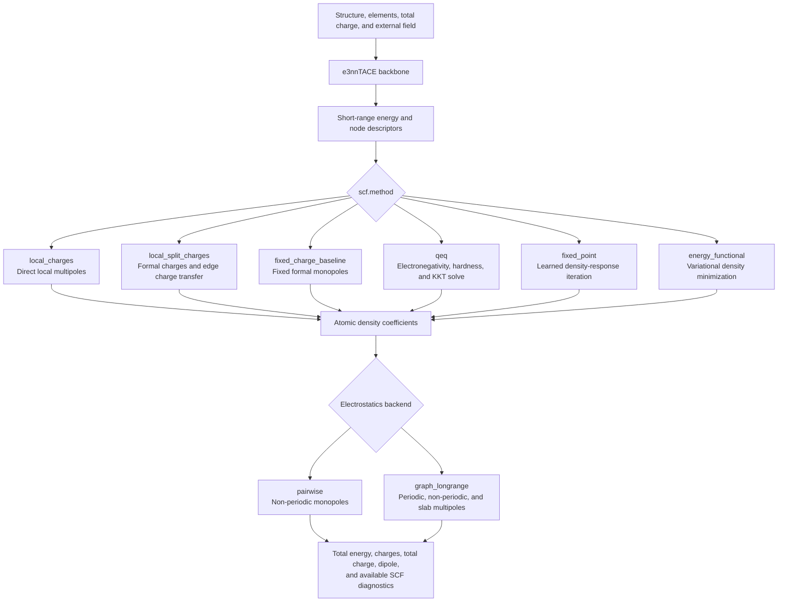
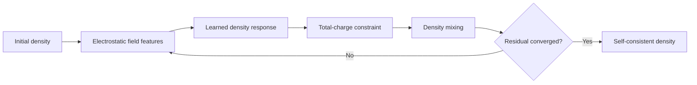

# TACE SCF models

> [!WARNING]
> This package ports the model families explored by
> [`mace-scf`](https://github.com/ACEsuit/mace-scf) to the TACE representation
> backbone.
>
> **This project is currently an experimental port created solely out of
> the author's personal interest. Please do not use it.**

Use `tace.models.SCFTACE` and add an
`scf` section to an otherwise normal e3nn TACE model configuration. The
available `method` values are:

- `local_charges`: one-shot local atomic multipoles;
- `local_split_charges`: locally conserved edge charge transfer plus atomic
  higher multipoles;
- `fixed_charge_baseline`: fixed formal monopoles and learned short-range TACE;
- `qeq`: charge equilibration from learned electronegativity and hardness;
- `fixed_point`: self-consistent learned density response;
- `energy_functional`: variational minimization of a learned density energy.

Example:

```yaml
model:
  config:
    _target_: tace.models.scf.SCFTACE
    scf:
      method: fixed_point
      density_max_l: 1
      feature_max_l: 1
      feature_smearing_widths: [1.0]
      options:
        constant_charge: true
        num_scf_steps: 100
        scf_tolerance: 1.0e-6
        mixing_parameter: 0.25
      electrostatics:
        backend: graph_longrange
        density_smearing_width: 1.0
```

The `graph_longrange` backend is vendored under this directory at upstream
commit `66ef8753f1675ed77af10d9a03401d827cd3d188`. Vendoring avoids the upstream
package's obsolete `e3nn==0.4.4` installation pin while retaining periodic,
non-periodic, slab, Gaussian multipole, energy, and potential-feature
operations. It only uses dependencies already required by TACE, so the `scf`
installation extra is currently empty and remains the stable place for future
SCF-only dependencies.

For small non-periodic monopole tests, `backend: pairwise` provides a native
PyTorch Gaussian-charge implementation. It is not a replacement for the
multipolar periodic backend.

## Workflow

`SCFTACE` keeps the standard `e3nnTACE` representation backbone. The backbone
first computes the short-range energy and layer-wise node descriptors. The
selected SCF method then reads those descriptors to construct charges or atomic
multipoles, optionally solves a constrained or self-consistent problem, and
adds the electrostatic and field contributions to the short-range energy.

1. Build the graph and evaluate the normal TACE representation.
2. Select one of the local, constrained, or self-consistent density methods.
3. Construct atomic density coefficients; their first `0e` component is the
   atomic charge.
4. Evaluate electrostatic energies and, when required, electrostatic features.
5. Return the total energy together with charges, multipoles, dipoles, and SCF
   diagnostics.



The two iterative methods differ in what is optimized. `fixed_point` repeatedly
maps the current electrostatic field to a learned density response, mixes the
new density with the previous iterate, and stops when the residual converges.
`energy_functional` instead differentiates a learned density functional and
updates the density along its projected energy gradient. Both methods can
enforce the requested total charge throughout the iteration.


